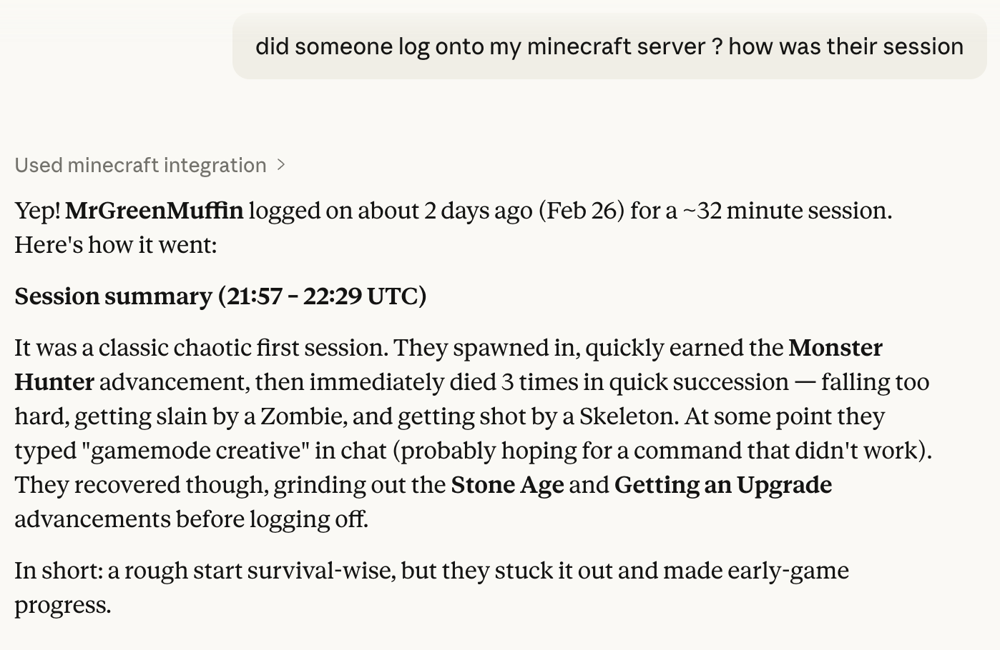

# ⛏️ Minecraft Server Dashboard

> A data pipeline, live dashboard, and AI assistant for self-hosted vanilla Minecraft servers.

<div align="center">
  
</div>

<div align="center">

[](https://python.org)
[](https://minecraft-project.streamlit.app/)
[](https://cloud.google.com/bigquery)
[](https://modelcontextprotocol.io)

</div>

Ever wanted to know who died the most, what mob is the biggest threat, or brag about your kill/death ratio — all in real time? Now you can.

This project turns a vanilla Minecraft server's raw logs and stats files into:

- 📊 A **live dashboard** with leaderboards, event timelines, and stat trends — no plugins, no mods
- 🤖 An **AI assistant** you can ask anything via Claude Desktop: *"What happened today?", "Who's winning?", "Tell me about Steve's adventure"*

---

## Architecture

```
Minecraft Server (GCP)
       │
   Collector  ──► BigQuery ──► Streamlit Dashboard
                     │
               MCP Server ──► Claude Desktop (natural language Q&A)
```

| Component | What it does |
|-----------|-------------|
| **Collector** | Tails `logs/latest.log` and `world/stats/*.json`, streams structured events + player snapshots to BigQuery every ~2 min |
| **Dashboard** | Streamlit app with live leaderboards, event timelines, mob breakdowns, and stat trends |
| **MCP Server** | FastMCP server that gives Claude Desktop 7 tools to answer natural language questions, backed by real BigQuery data |

---

## Features

<div align="center">
  
</div>

**📊 Live Dashboard** — [minecraft-project.streamlit.app](https://minecraft-project.streamlit.app/)

- Player leaderboards: kills, deaths, blocks mined, distance traveled, play hours
- Full event timeline — every death, advancement, join/leave, and chat message
- Mob kill breakdowns and item stat deep-dives
- Auto-refreshes so you never miss the moment someone gets blown up by a creeper

**🔄 Data Collector**

- Parses vanilla server logs with regex — no plugins or mods needed
- Reads player stats JSON from `world/stats/` and maps UUIDs to names via `usercache.json`
- Byte-offset tracking means no double-processing on restarts or log rotations

**🤖 AI Q&A via Claude Desktop**

<div align="center">
  
  <br><em>Claude, armed with 7 tools and zero chill, answering your server questions</em>
</div>

<br>

| Tool | What it does |
|------|-------------|
| `get_player_stats` | Latest stats + derived metrics (K/D ratio, distance in km, play hours) |
| `get_recent_events` | Event timeline filtered by type, player, or time window |
| `get_leaderboard` | Rankings for any stat |
| `compare_players` | Head-to-head rivalry breakdown |
| `get_mob_report` | Most dangerous mobs / most hunted mobs |
| `get_item_breakdown` | Top items by category (mined, crafted, used, etc.) |
| `get_server_summary` | Server-wide cumulative + 7-day activity stats |

**Example:**



---

## Quick Start

<div align="center">
  
  <br><em>Your friends when they find out you've been logging every death</em>
</div>

<br>

### Option 1: Just the Dashboard

The live dashboard is at **[minecraft-project.streamlit.app](https://minecraft-project.streamlit.app/)**.

To run it locally:

```bash
pip install minecraft-dashboard

export MC_GCP_PROJECT_ID=your-project-id
export GOOGLE_APPLICATION_CREDENTIALS=/path/to/key.json

streamlit run dashboard/app.py
```

---

### Option 2: Claude Desktop via Docker *(easiest for non-technical players)*

No Python required — just Docker and a credentials file. Full walkthrough in [mcp_server/ONBOARDING.md](mcp_server/ONBOARDING.md).

**1. Pull the image**

```bash
docker pull dockjacker/minecraft-mcp:latest
```

**2. Configure Claude Desktop**

Open `~/Library/Application Support/Claude/claude_desktop_config.json` (Mac) or `%APPDATA%\Claude\claude_desktop_config.json` (Windows) and add:

```json
{
  "mcpServers": {
    "minecraft": {
      "command": "docker",
      "args": [
        "run", "--rm", "-i", "--init",
        "-v", "/path/to/minecraft-sa-key.json:/gcp/creds.json:ro",
        "-e", "GOOGLE_APPLICATION_CREDENTIALS=/gcp/creds.json",
        "dockjacker/minecraft-mcp:latest"
      ]
    }
  }
}
```

**3. Restart Claude Desktop and start asking questions.**

---

### Option 3: Full Stack *(server admins)*

```bash
git clone <repo-url>
cd minecraft_project
pip install -e .

export MC_SERVER_DIR=/path/to/minecraft-server
export MC_GCP_PROJECT_ID=your-project-id
export GOOGLE_APPLICATION_CREDENTIALS=/path/to/key.json

mc-collect      # collector loop (runs every 2 min)
mc-dashboard    # Streamlit dashboard
minecraft-mcp   # MCP server for Claude Desktop
```

---

## Configuration

| Variable | Default | Description |
|----------|---------|-------------|
| `MC_SERVER_DIR` | *(required)* | Path to the Minecraft server root directory |
| `MC_GCP_PROJECT_ID` | `minecraft-free-487319` | Google Cloud project ID |
| `MC_BQ_DATASET` | `minecraft` | BigQuery dataset name |
| `MC_COLLECT_INTERVAL_SECONDS` | `120` | Collection interval in seconds |
| `GOOGLE_APPLICATION_CREDENTIALS` | *(required)* | Path to GCP service account key JSON |

---

## Development

```bash
pip install -e ".[dev]"         # install with dev deps
python -m pytest tests/ -v      # run tests
mcp dev mcp_server/server.py    # test MCP server with the Inspector
```

**Project structure:**

```
minecraft_project/
├── collector/      # Log parser, stats reader, BigQuery writer
├── dashboard/      # Streamlit app
├── mcp_server/     # MCP server (FastMCP), SQL query builders, semantic layer
├── schemas/        # BigQuery table schemas
├── config.py       # Pydantic Settings, all MC_ env vars
└── tests/
```

---

## How it works

The **collector** tails `logs/latest.log` using byte-offset tracking so restarts never reprocess old events. It parses deaths, advancements, joins, and chat with regex against the vanilla log format, then streams to BigQuery via `insert_rows_json`. Every cycle it also reads `world/stats/*.json` and writes a full cumulative snapshot per player.

The **MCP server** uses `ROW_NUMBER() OVER (PARTITION BY player ORDER BY snapshot_time DESC)` to always get the latest snapshot, `SAFE_DIVIDE` for null-safe ratios, and a semantic layer (embedded in Python, not YAML) that tells Claude how to narrate raw numbers as engaging stories.

---

<div align="center">
  <em>Made with ⛏️ and way too much time on a Minecraft server — no creepers were harmed in the making of this dashboard</em>
</div>
